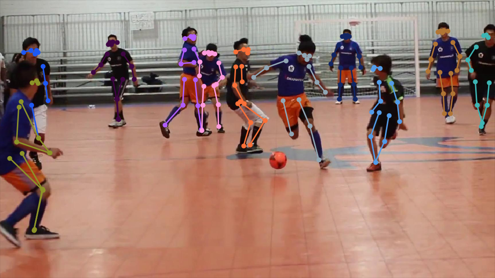

# Human Pose Estimation with TensorFlow



Here you can find the implementation of the Human Body Pose Estimation algorithm,
presented in the [ArtTrack](http://arxiv.org/abs/1612.01465) and [DeeperCut](http://arxiv.org/abs/1605.03170) papers:

**Eldar Insafutdinov, Leonid Pishchulin, Bjoern Andres, Mykhaylo Andriluka and Bernt Schiele
DeeperCut:  A Deeper, Stronger, and Faster Multi-Person Pose Estimation Model.
In _European Conference on Computer Vision (ECCV)_, 2016**

**Eldar Insafutdinov, Mykhaylo Andriluka, Leonid Pishchulin, Siyu Tang, Evgeny Levinkov, Bjoern Andres and Bernt Schiele
ArtTrack: Articulated Multi-person Tracking in the Wild.
In _Conference on Computer Vision and Pattern Recognition (CVPR)_, 2017**

For more information visit http://pose.mpi-inf.mpg.de

Python 3 is required to run this code.
First of all, you should install TensorFlow as described in the
[official documentation](https://www.tensorflow.org/install/).
We recommended to use `virtualenv`.

You will also need to install the following Python packages:

```
$ pip install scipy scikit-image matplotlib pyyaml easydict cython munkres
```

When running training or prediction scripts, please make sure to set the environment variable
`TF_CUDNN_USE_AUTOTUNE` to 0 (see [this ticket](https://github.com/tensorflow/tensorflow/issues/5048)
for explanation).

If your machine has multiple GPUs, you can select which GPU you want to run on
by setting the environment variable, eg. `CUDA_VISIBLE_DEVICES=0`.

## Demo code

Single-Person (if there is only one person in the image)

```
# Download pre-trained model files
$ cd models/mpii
$ ./download_models.sh
$ cd -

# Run demo of single person pose estimation
$ TF_CUDNN_USE_AUTOTUNE=0 python demo/singleperson.py
```

Multiple People

```
# Compile dependencies
$ ./compile.sh

# Download pre-trained model files
$ cd models/coco
$ ./download_models.sh
$ cd -

# Run demo of multi person pose estimation
$ TF_CUDNN_USE_AUTOTUNE=0 python demo/demo_multiperson.py
```

## Training models

Please follow these [instructions](models/README.md)

## Citation
Please cite ArtTrack and DeeperCut in your publications if it helps your research:

    @inproceedings{insafutdinov2017cvpr,
	    title = {ArtTrack: Articulated Multi-person Tracking in the Wild},
	    booktitle = {CVPR'17},
	    url = {http://arxiv.org/abs/1612.01465},
	    author = {Eldar Insafutdinov and Mykhaylo Andriluka and Leonid Pishchulin and Siyu Tang and Evgeny Levinkov and Bjoern Andres and Bernt Schiele}
    }

    @article{insafutdinov2016eccv,
        title = {DeeperCut: A Deeper, Stronger, and Faster Multi-Person Pose Estimation Model},
	    booktitle = {ECCV'16},
        url = {http://arxiv.org/abs/1605.03170},
        author = {Eldar Insafutdinov and Leonid Pishchulin and Bjoern Andres and Mykhaylo Andriluka and Bernt Schiele}
    }

